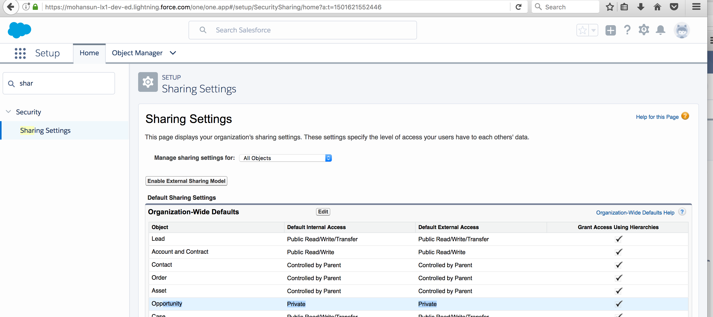
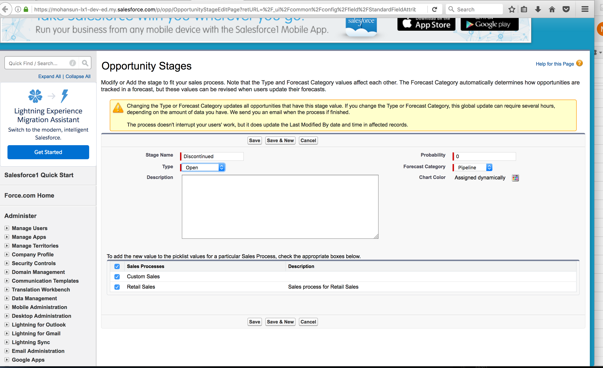
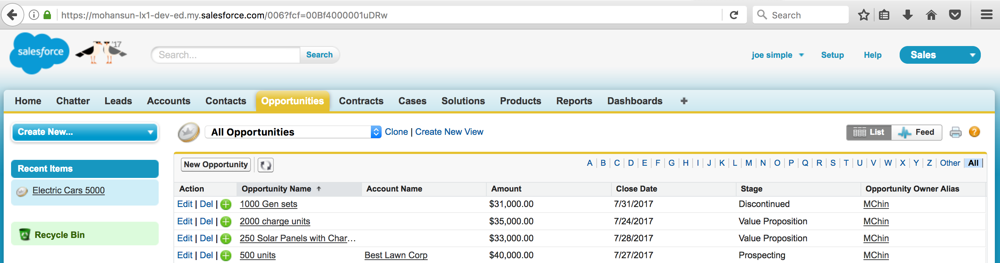
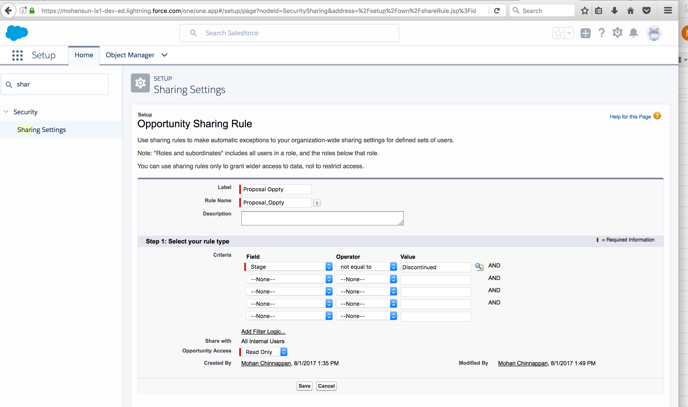
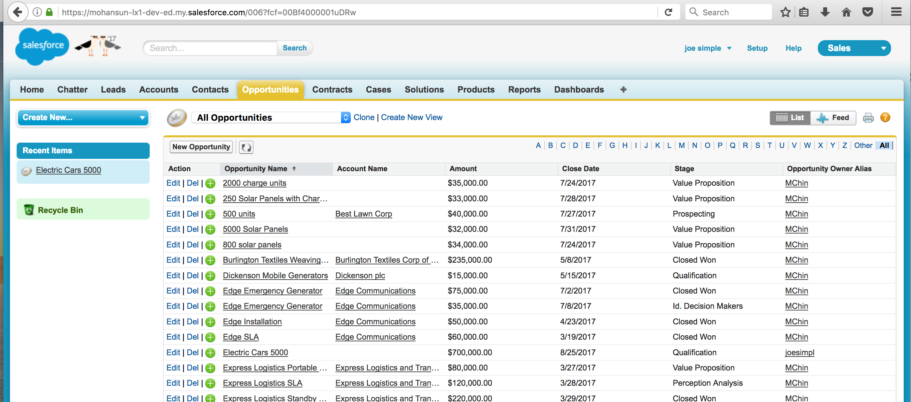

## Controlling access to the Opportunity based on particular Opportunity.Stage to non-owner users

#### Use case: Company: ACME computing
- Org-wide-default of Opportunity is private
- Likes introduce new Opportunity stage called: **Discontinued**
- Likes to provide read-only access to the Opportunities ( to non-owners) with a restriction: they can see the Opportunities if they do not own and the Opportunity Stage is NOT **Discontinued**

#### Steps

- Make sure Org-wide-default for Opportunity is private

 

- Create new item for Opportunity.Stage **Discontinued** with Probability 0%

 

- User Joe Simple can see the Discontinued Opportunities now:

 

- Create a criteria based sharing rule for Opportunity to:  provide read-only access to the Opportunities (to non-owners) with a restriction: they can see the Opportunities if they do not own and the Opportunity Stage is NOT **Discontinued**

 

- Now user Joe Simple can't see Discontinued Opportunities:
  

